<!-- cover image -->

<!-- end cover image -->

 

<!-- about me -->
<h2 align="center"> :bust_in_silhouette: About Me :bust_in_silhouette: </h2>

 

:round_pushpin: Currently living in **Riyadh, Saudi Arabia**

<!-- :mortar_board: I dropped out from **university (Computer Science, University of the People)**. -->

<!-- :briefcase: I'm currently doing full time job at **JoulesLabs** as a **Software Engineer**. -->

:book: Love to explore **new technologies** and build **solutions**.

:seedling: Observing the AI movement worldwide.

<!-- 🤝  I’m looking for help with **fixing bugs.** -->

👨‍💻 All of my projects are available in my [**website**](https://mustaquenadim.com/).

📝 I write articles on [**Medium**](https://mustaquenadim.medium.com/).

<!-- 🏫 I help people to learn **C, C++, JavaScript, React.js, Node.js, Express.js, MongoDB**, etc. -->

📫 Reach me through **[hello@mustaquenadim.com](mailto:hello@mustaquenadim.com)**.

<!-- 📄 Know about my experiences in my [**resume**](https://mustaquenadim.com/Mustaque-Nadim-Software-Engineer-Resume.pdf) -->

<!-- ⚡  Fun fact **I'm idle so that I always try to code short.** -->

:runner: I workout **every morning**.

<!-- end about me -->

 
 

<!-- language & tools -->
<h2 align="center">🛠 Languages and Tools 🛠</h2>
 

  

  

  

  

<!-- end language & tools -->

 
 

<!-- github analytics -->
<h2 align="center"> 📊 GitHub Analytics 📊 </h2>
 

  

  

  

<!-- end github analytics -->

 
 

<!-- github profile trophy -->
<h2 align="center"> :trophy: GitHub Profile Trophy :trophy: </h2>

 

  

<!-- end github profile trophy -->

 
 

<!-- connect with me -->
<h2 align="center">🔗 Connect with Me 🔗</h2>

 

  
  
  
  

<!-- end connect with me -->

<!-- <h3 align="center">✨ Support ✨</h3>

 -->

 
 

2026 ©️ mustaquenadim

